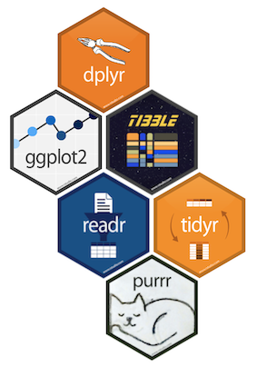

# Welcome to the SMH R Workshop Series!

### Workshop 1- Data visualization and data manipulation in the R Tidyverse 
* Workshop materials [here](https://rstudio.cloud/project/256912)

### Workshop 2- R in the life of a researcher (March 26, 11:00AM, Eyesha Hashim)

### Workshop 3- Statistical analysis with R (April 23, 12:00PM, Charles Keown-Stoneman)

---

<!-- # Goals of today -->

<!-- ## 1) Learn the basics of modern R programming -->
<!-- ## 2) Create simple data visualizations using ggplot2 -->
<!-- ## 3) Learn the basics of data manipulation using dplyr -->

<!-- ### I will assume that you have some knowledge/experience of programming. -->
<!-- --- -->

# During the workshops...

### There will be a few of us in the room who can help with any technical difficulties.

## 1) If you have any technical difficulties, please flag one of us down and we'll be happy to help.

## 2) If you have any questions related to the content, please stop me at any time!

---

# What is R?

- R is a free statistical programming language
- R is open source, and R packages are created by the community
- Many R packages are built for data analysis 
- R is **flexible** and **rapidly developing**
- R can be downloaded [here](https://www.r-project.org/)

---

## RStudio

- RStudio is a company that created the RStudio IDE (integrated development environment) for R
- The RStudio IDE is a great tool for doing data analysis in R
- RStudio can be downloaded freely [here](https://www.rstudio.com/products/rstudio/download/)

---

## Tidyverse

- One of the challenges with learning R is the lack of consistency between packages
- The tidyverse is a suite of packages developed by RStudio to help create a more unified R experience

.center[]

---

# Tasks for today

## Data visualization with ggplot2
1. Visualizing univariate distributions
2. Visualizing relationships between two continuous variables with a scatterplot
3. Visualizing relationships between a continuous and discrete variable
4. Faceting visualizations to show conditional relationships

## Data manipulation with dplyr
1. Filtering rows
2. Selecting columns
3. Creating new variables
4. Summarising variables
5. Grouped operations

---

# R for Data Science

Today's workshop will highlight a lot of concepts originated from [R for Data Science](https://r4ds.had.co.nz/index.html) by Hadley Wickham and Garrett Grolemund. 

.center[]

.center[Tidy data analysis workflow proposed by Hadley et al.]

---


# .center[Let's flip over to RStudio Cloud.]

---

# ggplot2 basics

## ggplots are built using a **data source**, mapping parameters (**aes**), **geoms**, and other helper functions


```{r eval = F}

# General ggplot2 syntax

ggplot(data,
       aes(...)) +
  geom_type1(aes(...), ...) +
  geom_type2(aes(...), ...) +
  helper_1(...) + 
  helper_2(...)

```

---

# **aes** parameters

## **aes** parameters are aesthetic parameters that pertain to how to construct and style the plot (e.g. data mappings, colours, sizes)

- **x** - variable mapped to the x-axis
- **y** - variable mapped to the y-axis
- **colour, fill, shape, size, ... **  - specifications for geom layers

---

# **geoms**

## **geoms** are geometric shapes that describe what type of plot you are creating (e.g. scatter plot, line plot, bar plot)

- **geom_point()** - creates "points" (e.g. scatterplot)
- **geom_line()** - line graphs
- **geom_histogram()** - histograms
- **geom_boxplot()** - boxplots
- ... and [LOTS more](https://ggplot2.tidyverse.org/reference/index.html)

---


# Helper functions

## Other helper functions provide additional customizability of your overall plot (e.g. faceting, themes)

- **facet_wrap()** - creates panel plots conditioned by a discrete variable
- **scale_...()** - helps rescale axes (many variations of scale functions, e.g. scale_x_continuous(), scale_y_continuous())
- **theme()** - customizes visual aspects of the plot (fonts, themes)


---

# Your R journey begins here!

### If you think R is the right tool for you, the best way to learn it is to use it!

### There are many resources online, but for most users, you will only need one to become proficient: [R for Data Science free textbook](https://r4ds.had.co.nz/index.html)

---


# Thanks for coming!

### Workshop 2- R in the life of a researcher (March 26, 11:00AM, Eyesha Hashim)

### Workshop 3- Statistical analysis with R (April 23, 12:00PM, Charles Keown-Stoneman)

### ...and potentially more to come!

---

# Get in touch!

David Dai, Data Scientist @ [LKS-CHART](chartdatascience.com)
- daiw@smh.ca
- Twitter @dwhdai
- [LinkedIn](https://www.linkedin.com/in/dwhdai/), [Personal website](https://davidd-ai.netlify.com/)
